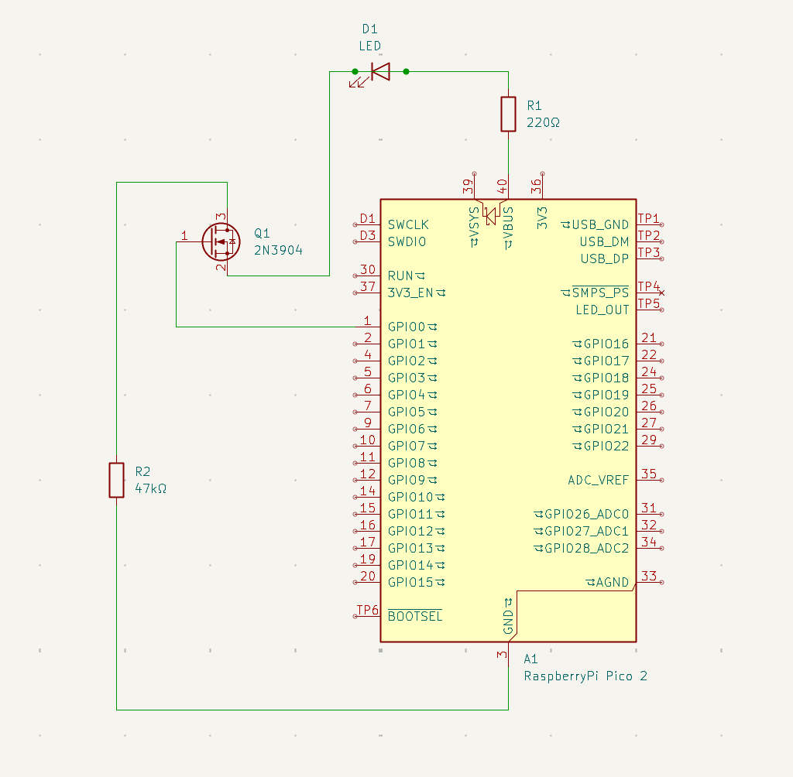

# Raspberry Pi Pico LED Control

This project provides a tick-based MicroPython implementation for simultaneously and independently controlling and powering up to 23 groups of LEDs with a single Raspberry Pi Pico microcontroller.

## How to Use

* Install MicroPython on your device, non Raspberry Pi Pico boards may require amending code to work with their GPIO.
* The program requires a JSON config file (example in /config/test.json).
    * This JSON is a list of GPIO pins you want to control, and the list of actions each LED group should take. When an LED reaches the end of its actions it loops round to the start.
    * Action options are: static light, breathing, flickering, blinking, and fading. Each have option requirements which can be found in src/duty_cycle_calculator.py
* pinNo is the GPIO number.
* Upload the src directory to your device root.

## Circuit Diagram

Below is an example of how to wire a single LED to GPIO0.

* R1 resistance is determined by the power requirements of your LED, 220 ohms is usually good for most single LEDs or LED filaments, but smaller or larger resistors can be used as required for particularly small or large LEDs, or LED groups.

